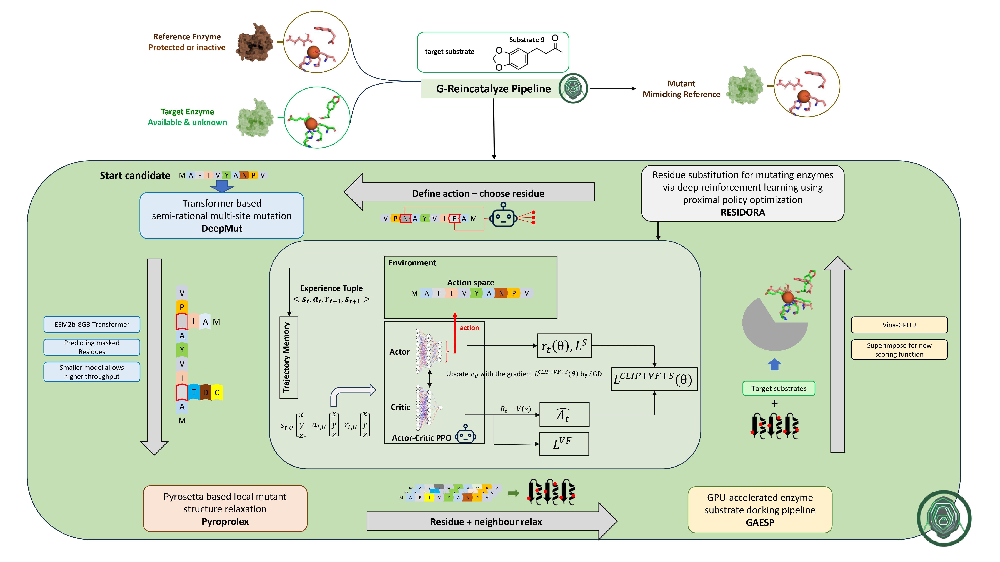

# G-ReInCATALiZE

**G**PU-accelerated **Re**inforcement learning-enabled **In**tegrated **C**ombination of **A**utomated **T**ransformer-based **A**pproaches with **Li**gand binding and 3D prediction for En**z**yme **E**volution

<div align="center">
  
</div>

---

## About

G-ReInCATALiZE is an advanced computational pipeline for **in-silico enzyme evolution**, developed by the CCBIO team at the University of Applied Sciences (ZHAW) in Wädenswil. The system combines cutting-edge machine learning approaches to optimize enzyme mutations for improved catalytic activity with specific target substrates.

**Key Capabilities:**
- Find optimal enzyme mutants from wildtype enzymes for targeted ligand transformations
- GPU-accelerated molecular docking and structure prediction
- Reinforcement learning-guided mutation optimization
- Transformer-based mutation effect prediction using ESM2 models

## Architecture

The pipeline integrates four main computational components as shown in the overview diagram:

1. **DeepMut** - ESM2 transformer-based semi-rational multi-site mutation prediction
2. **RESIDORA** - Deep reinforcement learning using Proximal Policy Optimization (PPO) for residue substitution
3. **Pyroprolex** - PyRosetta-based local mutant structure relaxation
4. **GAESP** - GPU-accelerated enzyme-substrate docking pipeline using Vina-GPU

The system uses an actor-critic reinforcement learning architecture to iteratively improve enzyme candidates through mutation and structural evaluation cycles.

## Getting Started

### Prerequisites

- **Docker** with GPU support
- **NVIDIA Container Toolkit** for GPU acceleration
- NVIDIA GPU with CUDA support

### Quick Start with Docker

1. **Build the container:**
   ```bash
   docker build --platform linux/amd64 -t gaesp .
   ```

2. **Run with GPU support:**
   ```bash
   docker run -d --gpus all --name gaesp-container -p 80:80 gaesp
   ```

3. **Execute the pipeline:**
   ```bash
   # Standard execution
   PYTHONPATH=. python src/main.py --config src/CONFIG/config_default.yaml

   # Debug mode
   PYTHONPATH=. python src/main.py --config src/CONFIG/config_debug.yaml
   ```

## Usage

### Configuration

The pipeline is configuration-driven using YAML files in `src/CONFIG/`. Key configuration sections:

- **`globalConfig`** - Transformer models, GPU settings, file paths
- **`gaespConfig`** - Wildtype sequence, structure paths, docking parameters
- **`pyroprolexConfig`** - PyRosetta mutation settings

### Example Configuration

```yaml
config1:
  globalConfig:
    transformerName: facebook/esm2_t6_8M_UR50D
    transformerDevice: cuda:0
    gpu_vina: true

  gaespConfig:
    wildTypeAASeq: "MSTETLRLQKARATEEGLAFETPGGLT..."
    wildTypeStructurePath: data/raw/enzyme.pdb
    reference_ligand: data/raw/reference/ligand.pdb
    boxSize: 15
    num_modes: 5
```

### Running Tests

```bash
pytest tests/
```

## Development Setup

### Local Development (Advanced)

<details>
<summary>Click to expand detailed installation instructions</summary>

The Docker container includes a complex molecular biology software stack. For local development, you'll need:

#### Core Dependencies
- **Python 3.8+** with Poetry for dependency management
- **PyTorch** with CUDA support
- **Transformers** library for ESM2 models

#### Molecular Biology Tools
- **Boost Library 1.82.0**
- **Vina-GPU-2.0** for GPU-accelerated docking
- **AutoDock-Vina** for scripting support
- **OpenBabel** for chemical structure processing
- **PyRosetta** for protein structure manipulation
- **ADFRsuite-1.0** for additional docking utilities

#### Installation Commands

**Boost Library:**
```bash
wget https://boostorg.jfrog.io/artifactory/main/release/1.82.0/source/boost_1_82_0.tar.bz2
tar --bzip2 -xf boost_1_82_0.tar.bz2
cd boost_1_82_0
sudo ./bootstrap.sh
sudo ./b2 install
```

**Vina-GPU-2.0:**
```bash
git clone https://github.com/DeltaGroupNJUPT/Vina-GPU-2.0
# Configure Makefile with appropriate paths
cd Vina-GPU-2.0/Vina-GPU+
make clean && make source
```

**OpenBabel:**
```bash
conda install -c conda-forge openbabel
```

**PyRosetta:**
Follow instructions at https://www.pyrosetta.org/downloads

</details>

### Package Management

```bash
# Install dependencies
poetry install

# Add new dependency
poetry add <package_name>

# Code formatting (Black configured for 79 character lines)
black src/
```

## License

Distributed under the MIT License.

## Contact

CCBIO Team - University of Applied Sciences (ZHAW), Wädenswil

---

*Developed for computational enzyme engineering and in-silico directed evolution research.*